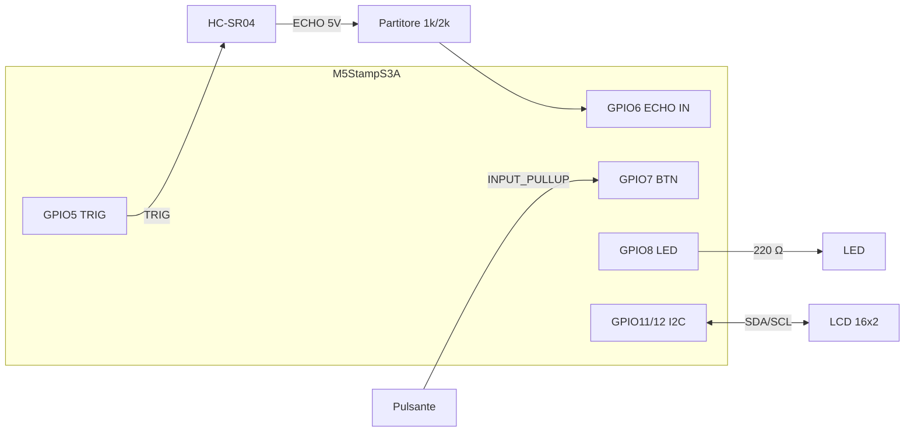
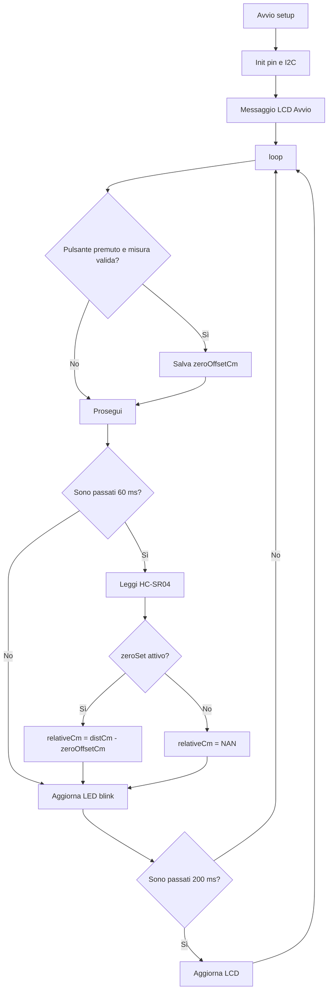

# Misuratore di Distanza con Calibrazione su M5StampS3A

> Realizza un metro digitale con HC-SR04, LCD 16x2, pulsante di azzeramento relativo e LED con lampeggio proporzionale alla vicinanza.

---

## 📋 Panoramica

**Descrizione breve:** Misura la distanza assoluta in cm/mm, imposta uno zero di riferimento con un pulsante e mostra la distanza relativa. Usa il LED come indicatore tipo sensore di parcheggio: più l'ostacolo è vicino, più il LED lampeggia veloce.

**Tempo stimato:** 75–105 minuti  
**Difficoltà:** ⭐⭐⭐☆☆ (3/5)  
**Dispositivo target:** M5StampS3A (ESP32-S3)

---

## 🎯 Obiettivi

Al termine di questo tutorial lo studente sarà in grado di:

- [ ] Collegare HC-SR04, LCD I2C, pulsante e LED a M5StampS3A in sicurezza elettrica
- [ ] Misurare la distanza con trigger/echo e calcolare cm/mm
- [ ] Implementare una calibrazione "zero" per ottenere distanze relative
- [ ] Gestire un lampeggio LED proporzionale alla distanza usando logica non bloccante con `millis()`

---

## 🛒 Materiale necessario

| Componente | Quantità | Note |
|---|---|---|
| M5StampS3A | 1 | ESP32-S3 |
| HC-SR04 | 1 | Alimentazione 5V |
| LCD 16x2 con backpack I2C (PCF8574) | 1 | Indirizzo tipico `0x27` o `0x3F` |
| Pulsante momentaneo | 1 | Usato con `INPUT_PULLUP` |
| LED | 1 | Colore a scelta |
| Resistore LED | 1 | 220 Ω |
| Resistori per partitore echo | 2 | 1 kΩ + 2 kΩ (adattatore 5 V → 3,3 V) |
| Breadboard + jumper | 1 set | - |
| Cavo USB-C | 1 | Programmazione |

---

## 📚 Librerie necessarie

Installa da **Arduino IDE → Sketch → Includi libreria → Gestisci librerie**:

| Libreria | Versione minima | Link |
|---|---|---|
| `LiquidCrystal I2C` | 1.1.2 | [GitHub](https://github.com/johnrickman/LiquidCrystal_I2C) |

**Riferimenti:**
- [ESP32 Arduino Core](https://docs.espressif.com/projects/arduino-esp32/en/latest/)
- [Documentazione M5StampS3](https://docs.m5stack.com/en/core/stamps3)
- [Arduino pulseIn](https://docs.arduino.cc/language-reference/en/functions/advanced-io/pulseIn/)

---

## 🔌 Schema di cablaggio

> ⚠️ Spegni la scheda prima di cablare.  
> ⚠️ Proteggi il pin ECHO del sensore: il segnale esce a 5V e deve entrare a 3.3V sull'ESP32-S3.

### Pin utilizzati

| Segnale | GPIO M5StampS3A | Note |
|---|---|---|
| HC-SR04 TRIG | 5 | Uscita digitale |
| HC-SR04 ECHO (dopo partitore) | 6 | Ingresso digitale 3.3V |
| Pulsante | 7 | Tra pin e GND (`INPUT_PULLUP`) |
| LED | 8 | GPIO → 220 Ω → anodo LED |
| LCD SDA | 11 | I2C |
| LCD SCL | 12 | I2C |
| LCD VCC | 3V3 | Verifica il tuo backpack |
| LCD GND | GND | Massa comune |

> Evita GPIO0, GPIO45, GPIO46 (strapping/boot).

### Partitore per ECHO (obbligatorio)

```
HC-SR04 ECHO (5V) ----[ 1 kΩ ]----+----> GPIO6 (ECHO IN)
                                     |
                                   [ 2 kΩ ]
                                     |
                                    GND
```

### Cablaggio completo (ASCII)

```
M5StampS3A                          HC-SR04
-----------                         -------
GPIO5   --------------------------> TRIG
GPIO6 <--- partitore (1k/2k) <----- ECHO
5V      --------------------------> VCC
GND     --------------------------> GND

M5StampS3A                          LCD 16x2 I2C
-----------                         -----------
GPIO11 ---------------------------> SDA
GPIO12 ---------------------------> SCL
3V3    ---------------------------> VCC
GND    ---------------------------> GND

M5StampS3A                          Input/Output
-----------                         ------------
GPIO7   -------- pulsante --------> GND
GPIO8   ---[220 Ω]---> LED ---> GND
```

### Schema funzionale (renderizzabile)



---

## 🚀 Procedura passo per passo

### Step 1 — Configurare Arduino IDE

1. Installa [Arduino IDE 2.x](https://www.arduino.cc/en/software).
2. Apri **File → Preferenze** e aggiungi:
   ```
   https://raw.githubusercontent.com/espressif/arduino-esp32/gh-pages/package_esp32_index.json
   ```
3. Installa **esp32 by Espressif Systems** da **Gestore schede**.
4. Seleziona la scheda **ESP32S3 Dev Module**.
5. Imposta **USB CDC On Boot → Enabled**.
6. Seleziona la porta seriale corretta.

### Step 2 — Assemblare il circuito

1. Collega HC-SR04, LCD, pulsante e LED come da tabelle sopra.
2. Inserisci il partitore 1k/2k sulla linea ECHO prima del GPIO6.
3. Controlla che tutte le masse siano in comune.
4. Verifica che il LED abbia il resistore da 220 Ω in serie.
5. Se il display non mostra testo, prova l'indirizzo alternativo `0x3F`.

### Step 3 — Caricare il codice

Crea un nuovo sketch e incolla questo codice completo.

```cpp
#include <Arduino.h>
#include <Wire.h>
#include <LiquidCrystal_I2C.h>

// -------------------- Pinout --------------------
constexpr uint8_t TRIG_PIN = 5;
constexpr uint8_t ECHO_PIN = 6;   // dopo partitore 1k/2k
constexpr uint8_t BTN_PIN  = 7;   // INPUT_PULLUP
constexpr uint8_t LED_PIN  = 8;

constexpr uint8_t I2C_SDA = 11;
constexpr uint8_t I2C_SCL = 12;

LiquidCrystal_I2C lcd(0x27, 16, 2);

// -------------------- Config misura --------------------
constexpr float SOUND_SPEED_CM_US = 0.0343f;
constexpr uint32_t ECHO_TIMEOUT_US = 30000; // ~5 m teorici
constexpr float VALID_MIN_CM = 2.0f;
constexpr float VALID_MAX_CM = 400.0f;

// -------------------- Stato --------------------
float zeroOffsetCm = 0.0f;
bool zeroSet = false;

bool ledState = false;
uint32_t lastBlinkMs = 0;
uint32_t lastMeasureMs = 0;
uint32_t lastLcdMs = 0;

float distCm = NAN;
float relativeCm = NAN;

// Debounce pulsante
bool btnStable = HIGH;
bool btnLastRead = HIGH;
uint32_t btnLastChangeMs = 0;
constexpr uint16_t DEBOUNCE_MS = 30;

float readDistanceCm() {
  digitalWrite(TRIG_PIN, LOW);
  delayMicroseconds(3);
  digitalWrite(TRIG_PIN, HIGH);
  delayMicroseconds(10);
  digitalWrite(TRIG_PIN, LOW);

  uint32_t duration = pulseIn(ECHO_PIN, HIGH, ECHO_TIMEOUT_US);
  if (duration == 0) {
    return NAN; // timeout
  }

  float cm = (duration * SOUND_SPEED_CM_US) * 0.5f;
  if (cm < VALID_MIN_CM || cm > VALID_MAX_CM) {
    return NAN;
  }
  return cm;
}

bool buttonPressedEvent() {
  bool raw = digitalRead(BTN_PIN);

  if (raw != btnLastRead) {
    btnLastRead = raw;
    btnLastChangeMs = millis();
  }

  if ((millis() - btnLastChangeMs) > DEBOUNCE_MS && raw != btnStable) {
    btnStable = raw;
    if (btnStable == LOW) {
      return true;
    }
  }
  return false;
}

uint32_t blinkPeriodFromDistance(float cm) {
  if (isnan(cm)) {
    return 900; // misura non valida: lampeggio lento
  }

  // Vicino => periodo corto, lontano => periodo lungo
  float clamped = constrain(cm, 5.0f, 150.0f);
  long p = map((long)clamped, 5, 150, 80, 800);
  return (uint32_t)p;
}

void updateLedBlink(float cm) {
  uint32_t period = blinkPeriodFromDistance(cm);
  uint32_t halfPeriod = period / 2;

  if (millis() - lastBlinkMs >= halfPeriod) {
    lastBlinkMs = millis();
    ledState = !ledState;
    digitalWrite(LED_PIN, ledState ? HIGH : LOW);
  }
}

void updateDisplay(float absCm, float relCm) {
  lcd.clear();

  if (isnan(absCm)) {
    lcd.setCursor(0, 0);
    lcd.print("Fuori range");
    lcd.setCursor(0, 1);
    lcd.print("Controlla sensore");
    return;
  }

  float mm = absCm * 10.0f;

  lcd.setCursor(0, 0);
  lcd.print("D:");
  lcd.print(absCm, 1);
  lcd.print("cm ");
  lcd.print((int)mm);
  lcd.print("mm");

  lcd.setCursor(0, 1);
  if (zeroSet && !isnan(relCm)) {
    lcd.print("Rel:");
    lcd.print(relCm, 1);
    lcd.print("cm");
  } else {
    lcd.print("Rel: non tarato");
  }
}

void setup() {
  Serial.begin(115200);

  pinMode(TRIG_PIN, OUTPUT);
  pinMode(ECHO_PIN, INPUT);
  pinMode(BTN_PIN, INPUT_PULLUP);
  pinMode(LED_PIN, OUTPUT);
  digitalWrite(LED_PIN, LOW);

  Wire.begin(I2C_SDA, I2C_SCL);
  lcd.init();
  lcd.backlight();

  lcd.setCursor(0, 0);
  lcd.print("Distanziometro");
  lcd.setCursor(0, 1);
  lcd.print("Avvio...");
  delay(800);
}

void loop() {
  if (buttonPressedEvent() && !isnan(distCm)) {
    zeroOffsetCm = distCm;
    zeroSet = true;
  }

  // Misura ogni 60 ms circa
  if (millis() - lastMeasureMs >= 60) {
    lastMeasureMs = millis();
    distCm = readDistanceCm();

    if (!isnan(distCm) && zeroSet) {
      relativeCm = distCm - zeroOffsetCm;
    } else {
      relativeCm = NAN;
    }

    Serial.print("ABS(cm): ");
    Serial.print(distCm, 2);
    Serial.print(" | REL(cm): ");
    Serial.println(relativeCm, 2);
  }

  updateLedBlink(distCm);

  // Aggiorna LCD a 5 Hz
  if (millis() - lastLcdMs >= 200) {
    lastLcdMs = millis();
    updateDisplay(distCm, relativeCm);
  }
}
```

**Carica lo sketch:**
1. Collega M5StampS3A via USB-C.
2. Clicca su **Carica**.
3. Se l'upload fallisce, entra in download mode (BOOT + RESET) e riprova.

### Step 4 — Eseguire i test

| Test | Azione | Risultato atteso |
|---|---|---|
| Misura base | Punta il sensore verso un oggetto a 20-50 cm | LCD mostra valore in cm/mm |
| Taratura zero | Premi il pulsante | Riga 2 passa da `non tarato` a `Rel: ... cm` |
| Misura relativa | Avvicina/allontana l'oggetto dopo la taratura | `Rel` diventa positiva/negativa rispetto allo zero |
| Indicatore LED | Avvicina molto la mano | LED lampeggia sempre più veloce |
| Out of range | Allontana oltre range o copri male il sensore | LCD mostra `Fuori range` |

### Step 5 — Analizzare il flusso



**Punti chiave:**
- Misura, LED e display sono separati con timer a `millis()`.
- La calibrazione salva solo un offset: misura relativa = misura attuale - zero.
- Il sistema resta responsivo: nessun `delay()` lungo nel `loop()`.

---

## 🔧 Troubleshooting

| Problema | Causa probabile | Soluzione |
|---|---|---|
| Valore sempre 0 o NAN | ECHO non arriva al pin corretto | Controlla TRIG/ECHO e partitore |
| Letture instabili | Riflessi su superficie inclinata | Misura su superficie piana, riduci rumore con media mobile |
| LCD acceso ma vuoto | Indirizzo I2C errato | Prova `0x27` o `0x3F` |
| LED non lampeggia | LED invertito o resistore mancante | Verifica anodo/catodo e serie da 220 Ω |
| Upload fallisce | Porta o modalità boot errata | Seleziona la porta corretta, usa BOOT/RESET |
| Letture sballate vicino al sensore | Distanza sotto minimo fisico | Tieni l'oggetto oltre 2 cm |

---

## ✅ Quiz di verifica

**1.** Perché il pin ECHO richiede un partitore resistivo?
> Perché HC-SR04 esce a 5 V, mentre i GPIO ESP32-S3 tollerano 3,3 V.

**2.** Come si calcola la distanza in cm dal tempo di eco?
> `cm = (durata_us × 0.0343) / 2`.

**3.** Cosa memorizzi quando premi il pulsante di calibrazione?
> La distanza assoluta corrente in `zeroOffsetCm`.

**4.** A cosa serve usare `millis()` invece di `delay()` nel loop?
> Mantieni il sistema reattivo e gestisci task periodici in parallelo.

**5.** Se `relativeCm` è negativa, cosa significa?
> L'oggetto è più vicino rispetto al punto di zero impostato.

---

## 🔁 Estensioni consigliate

- [ ] Mostra una barra grafica su LCD (8 livelli di distanza)
- [ ] Applica media mobile su 5 campioni per ridurre il rumore
- [ ] Aggiungi buzzer passivo con beep più rapido quando la distanza cala
- [ ] Esponi i dati con web server ESP32 su pagina HTML locale
- [ ] Invia i campioni a un PC via seriale CSV per log e grafico

---

## 📎 Risorse aggiuntive

- [HC-SR04 datasheet (SparkFun)](https://cdn.sparkfun.com/datasheets/Sensors/Proximity/HCSR04.pdf)
- [Arduino `pulseIn()` reference](https://docs.arduino.cc/language-reference/en/functions/advanced-io/pulseIn/)
- [Arduino Debounce example](https://docs.arduino.cc/built-in-examples/digital/Debounce/)
- [ESP32 Arduino Core docs](https://docs.espressif.com/projects/arduino-esp32/en/latest/)

---

*Tutorial creato per uso didattico — licenza CC BY-SA 4.0*
