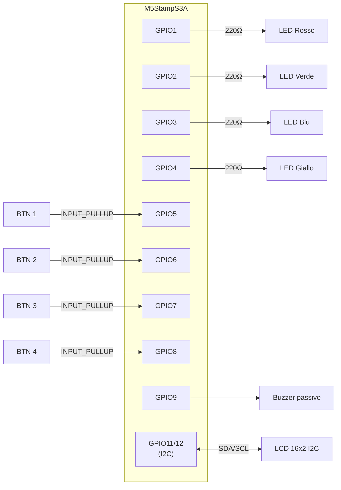
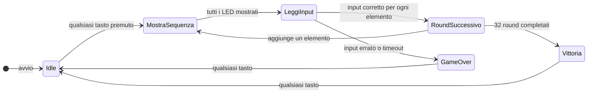
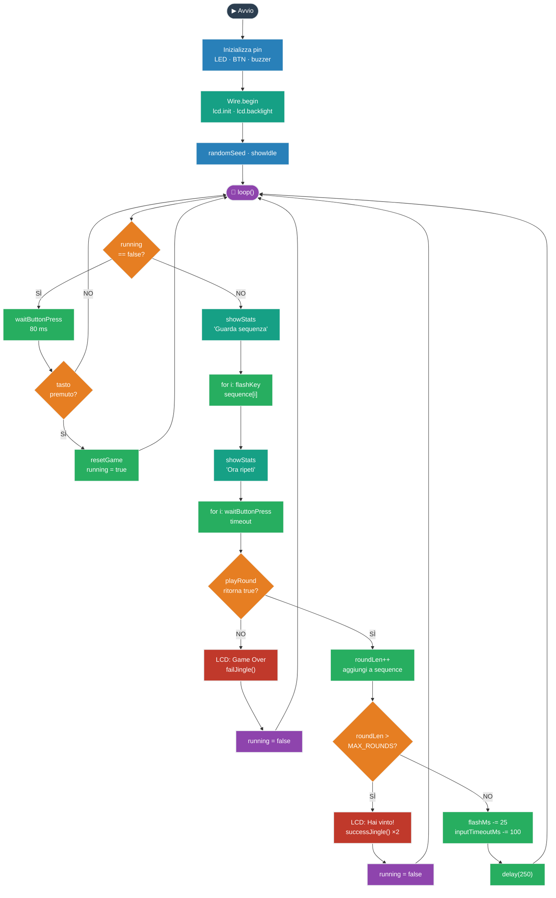

# Simon Says con M5StampS3A

> Realizza un gioco Simon Says standalone: 4 LED, 4 pulsanti, buzzer e LCD 16x2 — tutto gestito da un singolo `loop()`.

---

## 📋 Panoramica

**Descrizione breve:** Il microcontrollore mostra una sequenza di LED; il giocatore la ripete con i pulsanti. La difficoltà aumenta a ogni round.

**Tempo stimato:** 90–120 minuti  
**Difficoltà:** ⭐⭐⭐☆☆ (3/5)  
**Dispositivo target:** M5StampS3A (ESP32-S3)

---

## 🎯 Obiettivi

Al termine di questo tutorial lo studente sarà in grado di:

- [ ] Collegare 4 LED, 4 pulsanti, buzzer e LCD 16x2 a M5StampS3A
- [ ] Implementare una macchina a stati con `loop()` senza multitasking
- [ ] Gestire difficoltà crescente riducendo durata dei flash e timeout d'input
- [ ] Adattare il pin mapping alla propria carrier senza modificare la logica di gioco

---

## 🛒 Materiale necessario

| Componente | Quantità | Note |
|---|---|---|
| M5StampS3A | 1 | Chip ESP32-S3, 23 GPIO disponibili |
| LCD 16x2 + backpack I2C (PCF8574) | 1 | Indirizzo tipico `0x27` o `0x3F` |
| LED (rosso, verde, blu, giallo) | 4 | Resistore da 220 Ω in serie per ciascuno |
| Pulsanti momentanei | 4 | Pull-up interno (`INPUT_PULLUP`) |
| Buzzer piezoelettrico passivo | 1 | Necessario passivo: il PWM genera la frequenza |
| Breadboard + jumper | 1 set | — |
| Cavo USB-C | 1 | Alimentazione e upload |

---

## 📚 Librerie necessarie

Installa tramite **Arduino IDE → Sketch → Includi libreria → Gestisci librerie**:

| Libreria | Versione minima | Link |
|---|---|---|
| `LiquidCrystal I2C` | 1.1.2 | [GitHub](https://github.com/johnrickman/LiquidCrystal_I2C) |

**Riferimenti:**
- [ESP32 Arduino Core](https://docs.espressif.com/projects/arduino-esp32/en/latest/)
- [Docs M5Stack](https://docs.m5stack.com/)
- [M5StampS3A — pinout e schematico](https://docs.m5stack.com/en/core/stamps3)

---

## 🔌 Schema di cablaggio

> ⚠️ **Spegni la scheda prima di collegare qualsiasi filo.**

### Pin utilizzati

| Segnale | GPIO | Verso |
|---|---|---|
| LED rosso | 1 | Resistore 220 Ω → GND |
| LED verde | 2 | Resistore 220 Ω → GND |
| LED blu | 3 | Resistore 220 Ω → GND |
| LED giallo | 4 | Resistore 220 Ω → GND |
| Pulsante 1 | 5 | GND |
| Pulsante 2 | 6 | GND |
| Pulsante 3 | 7 | GND |
| Pulsante 4 | 8 | GND |
| Buzzer + | 9 | GND |
| LCD SDA | 11 | SDA backpack I2C |
| LCD SCL | 12 | SCL backpack I2C |
| LCD VCC | 3V3 | VCC |
| LCD GND | GND | GND |

> **Nota:** evita GPIO0, 45, 46 (pin di boot/strapping). Se usi una carrier diversa, modifica solo gli array `ledPins` e `buttonPins` nel codice.

### Schema di connessione

```
M5StampS3A
  GPIO1 ──[220Ω]── LED Rosso (+) ── GND
  GPIO2 ──[220Ω]── LED Verde (+) ── GND
  GPIO3 ──[220Ω]── LED Blu   (+) ── GND
  GPIO4 ──[220Ω]── LED Giallo(+) ── GND

  GPIO5 ──────── BTN1 ── GND
  GPIO6 ──────── BTN2 ── GND       (pull-up interno attivo)
  GPIO7 ──────── BTN3 ── GND
  GPIO8 ──────── BTN4 ── GND

  GPIO9 ──────── BUZZER(+)
  GND   ──────── BUZZER(-)

  GPIO11 (SDA) ──┐
  GPIO12 (SCL) ──┤── LCD 16x2 backpack PCF8574
  3V3          ──┤
  GND          ──┘
```

### Schema funzionale



---

## 🚀 Procedura passo per passo

### Step 1 — Configurare l'ambiente di sviluppo

1. Installa [Arduino IDE 2.x](https://www.arduino.cc/en/software).
2. Apri **File → Preferenze** e incolla nel campo *URL aggiuntivi per il gestore schede*:
   ```
   https://raw.githubusercontent.com/espressif/arduino-esp32/gh-pages/package_esp32_index.json
   ```
3. Vai su **Strumenti → Gestore schede**, cerca `esp32`, installa **esp32 by Espressif Systems**.
4. Seleziona **Strumenti → Scheda → ESP32S3 Dev Module** (o la voce specifica StampS3 se presente).
5. Imposta **Strumenti → USB CDC On Boot → Enabled** per vedere l'output seriale senza driver aggiuntivi.
6. Seleziona la porta corretta in **Strumenti → Porta**.

---

### Step 2 — Assemblare il circuito

1. Inserisci M5StampS3A sulla breadboard con i pin esposti.
2. Collega ogni LED: **anodo → resistore 220 Ω → GPIO** (1–4), **catodo → GND**.
3. Collega ogni pulsante tra il rispettivo GPIO (5–8) e GND. Nessun resistore esterno necessario.
4. Collega il buzzer passivo: pin **+** a GPIO9, pin **−** a GND.
5. Collega il backpack LCD: **SDA → GPIO11**, **SCL → GPIO12**, **VCC → 3V3**, **GND → GND**.
6. Verifica che tutti i componenti condividano la stessa barra GND sulla breadboard.

> 💡 **Scan I2C:** se il display non risponde, carica [questo sketch](https://playground.arduino.cc/Main/I2cScanner/) per rilevare l'indirizzo reale del backpack (`0x27` o `0x3F`).

---

### Step 3 — Caricare il codice

Crea un nuovo sketch in Arduino IDE, incolla il codice completo qui sotto e carica.

```cpp
// ============================================================
// Simon Says su M5StampS3A
// - 4 LED, 4 pulsanti, buzzer, LCD 16x2 I2C
// - Versione didattica senza multitasking
// ============================================================

#include <Arduino.h>
#include <Wire.h>
#include <LiquidCrystal_I2C.h>

// -------------------- PINOUT (adatta se necessario) --------------------
constexpr uint8_t NUM_KEYS = 4;
constexpr uint8_t MAX_ROUNDS = 32;

const uint8_t ledPins[NUM_KEYS] = {1, 2, 3, 4};
const uint8_t buttonPins[NUM_KEYS] = {5, 6, 7, 8};
const uint8_t buzzerPin = 9;

const uint8_t I2C_SDA = 11;
const uint8_t I2C_SCL = 12;

LiquidCrystal_I2C lcd(0x27, 16, 2);

// -------------------- STATO GIOCO --------------------
uint8_t sequence[MAX_ROUNDS];
uint8_t roundLen = 1;
uint8_t score = 0;
uint16_t flashMs = 520;
uint16_t inputTimeoutMs = 3000;
bool running = false;

void beep(uint16_t freq, uint16_t ms) {
  tone(buzzerPin, freq, ms);
  delay(ms);
  noTone(buzzerPin);
}

void flashKey(uint8_t idx, uint16_t onMs) {
  uint16_t beepMs = (onMs > 20) ? (onMs - 20) : onMs;
  digitalWrite(ledPins[idx], HIGH);
  beep(600 + idx * 180, beepMs);
  digitalWrite(ledPins[idx], LOW);
}

int8_t waitButtonPress(uint32_t timeoutMs) {
  uint32_t t0 = millis();

  while (millis() - t0 < timeoutMs) {
    for (uint8_t i = 0; i < NUM_KEYS; i++) {
      if (digitalRead(buttonPins[i]) == LOW) {
        delay(20);
        if (digitalRead(buttonPins[i]) == LOW) {
          while (digitalRead(buttonPins[i]) == LOW) {
            delay(5);
          }
          return i;
        }
      }
    }
    delay(1);
  }

  return -1;
}

void successJingle() {
  beep(880, 90);
  beep(1175, 90);
}

void failJingle() {
  beep(330, 250);
  beep(220, 400);
}

void showIdle() {
  lcd.clear();
  lcd.setCursor(0, 0);
  lcd.print("Simon Says");
  lcd.setCursor(0, 1);
  lcd.print("Premi un tasto");
}

void showStats(const char *line0) {
  char row[17];
  lcd.clear();
  lcd.setCursor(0, 0);
  lcd.print(line0);
  snprintf(row, sizeof(row), "R:%02u S:%02u", roundLen, score);
  lcd.setCursor(0, 1);
  lcd.print(row);
}

bool playRound() {
  showStats("Guarda sequenza");
  for (uint8_t i = 0; i < roundLen; i++) {
    flashKey(sequence[i], flashMs);
    delay(120);
  }

  showStats("Ora ripeti");
  for (uint8_t i = 0; i < roundLen; i++) {
    int8_t pressed = waitButtonPress(inputTimeoutMs);
    if (pressed < 0 || pressed != sequence[i]) {
      return false;
    }
    flashKey((uint8_t)pressed, 120);
    score++;
  }

  successJingle();
  return true;
}

void resetGame() {
  roundLen = 1;
  score = 0;
  flashMs = 520;
  inputTimeoutMs = 3000;
  sequence[0] = random(NUM_KEYS);
  running = true;
}

// -------------------- SETUP / LOOP --------------------
void setup() {
  Serial.begin(115200);

  for (uint8_t i = 0; i < NUM_KEYS; i++) {
    pinMode(ledPins[i], OUTPUT);
    digitalWrite(ledPins[i], LOW);
    pinMode(buttonPins[i], INPUT_PULLUP);
  }
  pinMode(buzzerPin, OUTPUT);

  Wire.begin(I2C_SDA, I2C_SCL);
  lcd.init();
  lcd.backlight();

  randomSeed((uint32_t)micros());
  showIdle();
}

void loop() {
  if (!running) {
    if (waitButtonPress(80) >= 0) {
      resetGame();
    }
    return;
  }

  if (!playRound()) {
    lcd.clear();
    lcd.setCursor(0, 0);
    lcd.print("Game Over");
    lcd.setCursor(0, 1);
    lcd.print("Premi restart");
    failJingle();
    delay(800);
    running = false;
    return;
  }

  roundLen++;
  if (roundLen > MAX_ROUNDS) {
    lcd.clear();
    lcd.setCursor(0, 0);
    lcd.print("Hai vinto!");
    lcd.setCursor(0, 1);
    lcd.print("Score massimo");
    successJingle();
    successJingle();
    delay(1200);
    running = false;
    return;
  }

  sequence[roundLen - 1] = random(NUM_KEYS);
  if (flashMs > 180) {
    flashMs -= 25;
  }
  if (inputTimeoutMs > 1200) {
    inputTimeoutMs -= 100;
  }

  delay(250);
}
```

**Carica lo sketch:**
1. Connetti M5StampS3A via USB-C.
2. Clicca ▶ **Carica** (o `Ctrl+U`).
3. Se l'upload fallisce: tieni premuto il tasto **G0/BOOT** sulla scheda, premi **RESET**, poi rilascia **BOOT**. Riprova il caricamento.

---

### Step 4 — Testare il comportamento

Esegui questi test in sequenza:

| # | Azione | Risultato atteso |
|---|---|---|
| 1 | Premi un pulsante qualsiasi | La partita parte, l'LCD mostra `Guarda sequenza` |
| 2 | Osserva la sequenza | Un LED si accende con un beep alla volta |
| 3 | Ripeti la sequenza con i pulsanti corretti | Jingle di successo, round successivo |
| 4 | Sbaglia un pulsante o aspetta il timeout | LCD mostra `Game Over` + jingle di errore |
| 5 | Premi qualsiasi tasto dopo Game Over | La partita riparte da capo |

---

### Step 5 — Analizzare la macchina a stati

Il `loop()` è organizzato come una macchina a stati con la variabile `running`.

#### Vista ad alto livello (stati)



#### Diagramma di flusso dettagliato (codice)



**Traccia il flusso nel codice:**
- `running == false` → stato `Idle`: aspetta un tasto, poi chiama `resetGame()`
- `running == true` → esegue `playRound()` (mostra sequenza + legge input)
- `playRound()` ritorna `false` → `GameOver`, `running = false`
- `roundLen > MAX_ROUNDS` → `Vittoria`, `running = false`
- Altrimenti: aggiorna difficoltà, `delay(250)`, torna a `loop()`

---

## 🔧 Troubleshooting

| Problema | Causa probabile | Soluzione |
|---|---|---|
| LCD acceso ma senza testo | Indirizzo I2C errato | Esegui lo [I2C Scanner](https://playground.arduino.cc/Main/I2cScanner/); usa l'indirizzo trovato in `LiquidCrystal_I2C lcd(0xXX, 16, 2)` |
| LED non si accende | Pin errato o LED invertito | Verifica anodo/catodo e il numero GPIO nell'array `ledPins` |
| Pulsante non risponde | Massa mancante o GPIO sbagliato | Controlla che l'altro piedino del pulsante sia su GND e aggiorna `buttonPins` |
| Buzzer muto | Buzzer attivo invece di passivo | Sostituisci con un buzzer passivo; quello attivo non risponde a `tone()` |
| Upload fallisce | Scheda non in modalità download | Tieni premuto BOOT, premi RESET, rilascia BOOT, riprova l'upload |
| Sequenza erratica | Conflitto di pin con il boot | Evita GPIO0, 45, 46; scegli pin alternativi e aggiorna gli array nel codice |

---

## ✅ Quiz di verifica

**1.** Perché si usa `INPUT_PULLUP` sui pulsanti?
> Il pin legge `HIGH` a riposo e `LOW` quando premi — senza resistori esterni.

**2.** In questa versione, dove gira tutta la logica di gioco?
> Nel `loop()` principale, governata dalla variabile `running`.

**3.** Come aumenta la difficoltà nel codice?
> Ogni round `flashMs` cala di 25 ms e `inputTimeoutMs` cala di 100 ms, fino ai minimi (180 ms e 1200 ms).

**4.** Cosa provoca la transizione verso `GameOver`?
> `playRound()` restituisce `false`: un pulsante sbagliato oppure nessuna pressione entro `inputTimeoutMs`.

**5.** *(Sfida)* Come aggiungeresti un livello "Facile" con flash da 800 ms e timeout di 5 s?
> Modifica `flashMs = 800` e `inputTimeoutMs = 5000` in `resetGame()`, oppure aggiungi una variabile `level` che imposta i valori iniziali.

---

## 🔁 Estensioni consigliate

- [ ] **Reaction Time puro** — accendi un LED casuale e misura il tempo di risposta in millisecondi
- [ ] **Record persistente** — salva il punteggio massimo in NVS con la libreria `Preferences`
- [ ] **Classifica locale** — mostra i migliori 3 punteggi su LCD con scroll
- [ ] **Temi sonori** — assegna note diverse (Do–Re–Mi–Fa) ai quattro colori
- [ ] **Dashboard Wi-Fi** — esponi round e punteggio su una pagina web in tempo reale con WebServer

---

## 📎 Risorse aggiuntive

- [Arduino — Debounce su pulsante](https://docs.arduino.cc/built-in-examples/digital/Debounce/)
- [Arduino — Riferimento `tone()`](https://docs.arduino.cc/language-reference/en/functions/advanced-io/tone/)
- [Arduino — I2C Scanner sketch](https://playground.arduino.cc/Main/I2cScanner/)

---

*Tutorial creato per uso didattico — licenza CC BY-SA 4.0*
